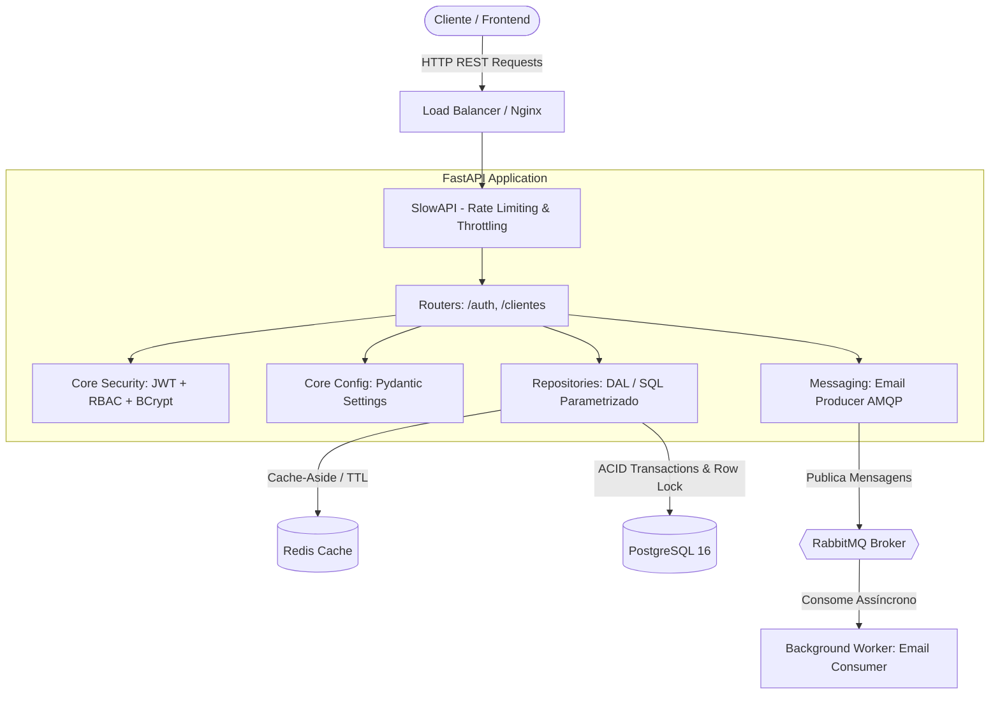

<div align="center">

# 👗 Loja de Roupas — Enterprise REST API & Asynchronous Architecture

**Uma API RESTful corporativa de alto desempenho para gestão de e-commerce e clientes, construída com arquitetura limpa, mensageria assíncrona, cache distribuído, autenticação RBAC e orquestração multi-container.**

[](https://www.python.org/)
[](https://fastapi.tiangolo.com/)
[](https://www.postgresql.org/)
[](https://redis.io/)
[](https://www.rabbitmq.com/)
[](https://www.docker.com/)
[](https://docs.pytest.org/)
[](https://github.com/)

</div>

---

## 🏛️ Visão Geral da Arquitetura

O sistema adota os princípios de **Clean Architecture**, **Separação de Responsabilidades (SRP)** e **12-Factor App**, dividindo a aplicação em camadas desacopladas de apresentação (Routers), regras de segurança e configuração (Core), repositórios de acesso a dados (Repositories), publicação de eventos (Messaging) e processos autônomos de segundo plano (Workers).



---

## 💡 Decisões de Engenharia & Destaques Técnicos

* ⚡ **Cache-Aside com Invalidação Ativa (Redis)**: Leitura acelerada de clientes via cache em memória com tempo de vida (*TTL* de 60s). Qualquer operação de mutação (`PATCH` ou `DELETE`) invalida imediatamente a chave correspondente no Redis, evitando inconsistência de dados (*stale cache*).
* 📬 **Mensageria Assíncrona & Workers (RabbitMQ + Pika)**: O envio de e-mails transacionais de boas-vindas não bloqueia o ciclo de requisição/resposta da API. A rota publica um evento na fila e responde com status `201 Created` em milissegundos, enquanto um processo *Worker* desacoplado consome e processa as mensagens de forma resiliente.
* 🔐 **Segurança em Camadas, RBAC e Tokens Revogáveis**:
  * **Criptografia**: Senhas protegidas com hashing `BCrypt` e *salt* criptográfico aleatório.
  * **RBAC (*Role-Based Access Control*)**: Autorização baseada em funções (`admin` vs `funcionario`), restringindo operações críticas (ex: exclusão de registros).
  * **JWT de Duplo Token com Revogação Ativa**: Emissão de *Access Token* de vida curta (15 min) e *Refresh Token* de vida longa (7 dias), com rastreamento de identificador único (*JTI*) no PostgreSQL para possibilitar revogação imediata via endpoint de logout.
* 🛡️ **Rate Limiting & Defesa contra Brute Force (SlowAPI)**: Proteção de infraestrutura aplicando limitação de taxa estrita nos endpoints sensíveis (ex: máximo de 5 requisições/minuto em `/auth/login`).
* 📦 **Configuração Centralizada e Segura (Pydantic Settings)**: Conformidade com o *12-Factor App*. Variáveis críticas (`JWT_SECRET_KEY`, `DB_PASSWORD`) não possuem valores padrão inseguros, impedindo a inicialização da aplicação em ambientes desprotegidos.
* 🧪 **Pirâmide de Testes Automatizados (Pytest & TestClient)**: Suíte com testes unitários puros (validação de criptografia e tokens) e testes de integração de ponta a ponta com *fixtures* dedicadas.

---

## 🛠️ Tecnologias Utilizadas

| Camada | Tecnologia | Finalidade |
|---|---|---|
| **Framework Web** | FastAPI + Uvicorn | API assíncrona de alta performance com OpenAPI/Swagger |
| **Banco de Dados** | PostgreSQL 16 + Psycopg2 | Persistência relacional com transações ACID e constraints |
| **Camada de Cache** | Redis 7 (Alpine) | Armazenamento chave-valor em memória para otimização de leitura |
| **Message Broker** | RabbitMQ 3 (Management) | Fila de mensageria assíncrona e desacoplamento de workers |
| **Validação de Dados** | Pydantic v2 + Pydantic-Settings | Schemas tipados e centralização de variáveis de ambiente |
| **Segurança & Auth** | Python-Jose + Passlib (BCrypt) | Emissão/validação de JWT e hash irreversível de senhas |
| **Rate Limiting** | SlowAPI | Controle de tráfego e mitigação de ataques de força bruta |
| **Conteinerização** | Docker + Docker Compose | Orquestração completa de 5 serviços em ambiente isolado |
| **Testes & CI** | Pytest + HTTPX + GitHub Actions | Pipeline automatizado de validação a cada push e PR |

---

## 🚀 Como Executar o Projeto

Graças à orquestração multi-container, o ecossistema inteiro sobe com **um único comando**, sem necessidade de instalar dependências locais.

### Pré-requisitos
* [Docker](https://docs.docker.com/get-docker/) e [Docker Compose](https://docs.docker.com/compose/) instalados.

### Passo a Passo

1. **Clone o repositório:**
   ```bash
   git clone https://github.com/RafaelSantanaM/loja_roupas.git
   cd loja_roupas
   ```

2. **Configure o arquivo de ambiente:**
   ```bash
   cp .env.example .env
   ```
   *(Preencha as senhas seguras no `.env` conforme desejado)*

3. **Inicie todos os serviços com o Docker Compose:**
   ```bash
   docker compose up --build
   ```

---

## 🌐 Endpoints & Documentação Interativa

Após iniciar o container, acesse a documentação interativa nos seguintes endereços:

* 📖 **Swagger UI (OpenAPI)**: [http://localhost:8000/docs](http://localhost:8000/docs)
* 📑 **Redoc**: [http://localhost:8000/redoc](http://localhost:8000/redoc)
* 🐰 **Painel de Gestão RabbitMQ**: [http://localhost:15672](http://localhost:15672) *(login: `guest` / senha: `guest`)*

### Principais Rotas da API

| Método | Endpoint | Descrição | Acesso / RBAC | Rate Limit |
|---|---|---|---|---|
| `POST` | `/auth/login` | Autenticação e emissão de Access & Refresh Tokens | Público | 5 req/min |
| `POST` | `/auth/refresh` | Renovação de Access Token via Refresh Token | Público | 10 req/min |
| `POST` | `/auth/logout` | Revogação ativa do Refresh Token no banco | Autenticado | — |
| `GET` | `/clientes` | Listagem paginada e filtrável de clientes | Autenticado | 60 req/min |
| `GET` | `/clientes/{id}` | Busca cliente por ID (com Redis Cache) | Autenticado | — |
| `POST` | `/clientes` | Cadastro de cliente e publicação na fila AMQP | Autenticado | — |
| `PATCH` | `/clientes/{id}` | Atualização parcial e invalidação de cache | Autenticado | — |
| `DELETE` | `/clientes/{id}` | Remoção de cliente e invalidação de cache | **Apenas Admin** | — |

---

## 🧪 Executando os Testes Automatizados

Para rodar os testes unitários e de integração localmente:

```bash
# Ative o ambiente virtual e execute o pytest
pytest -v
```

---

## 📂 Estrutura do Projeto

```
loja_roupas/
├── .github/workflows/ci.yml       # Pipeline automatizado de CI (GitHub Actions)
├── app/
│   ├── core/                      # Configurações globais, segurança e cache
│   │   ├── config.py              # Pydantic Settings (12-Factor App)
│   │   ├── security.py            # Criptografia BCrypt e geração de JWT
│   │   └── cache.py               # Operações e estratégias Redis
│   ├── db/
│   │   ├── session.py             # Conexão segura com PostgreSQL
│   │   └── migrations/            # Migrações SQL numeradas e sequenciais (001 a 004)
│   ├── messaging/                 # Produtor de mensagens AMQP (RabbitMQ)
│   │   └── email_producer.py
│   ├── repositories/              # Camada de Acesso a Dados (DAL - Repository Pattern)
│   │   ├── cliente_repo.py
│   │   ├── usuario_repo.py
│   │   └── refresh_token_repo.py
│   ├── routers/                   # Controladores HTTP (FastAPI APIRouter)
│   │   ├── auth_router.py
│   │   └── clientes_router.py
│   ├── schemas/                   # Schemas de validação e serialização Pydantic
│   ├── workers/                   # Background Workers assíncronos
│   │   └── email_worker.py
│   ├── dependencies.py            # Injeção de dependências (OAuth2 & RBAC)
│   ├── limiter.py                 # Rate Limiter configurado (SlowAPI)
│   └── main.py                    # Ponto de entrada da aplicação FastAPI
├── docs/                          # Base de conhecimento e guias conceituais
│   ├── 01-modelagem-e-transacoes.md
│   ├── 02-autenticacao-jwt.md
│   ├── 03-rbac-autorizacao.md
│   ├── 04-testes-automatizados.md
│   ├── 05-roadmap-backend.md
│   ├── README.md                  # Índice da documentação
│   └── examples/                  # Scripts e demonstrações educativas
├── tests/                         # Suíte de testes automatizados (Unitários e Integração)
│   ├── conftest.py                # Fixtures globais do Pytest
│   ├── test_auth_unit.py          # Testes unitários de segurança
│   └── test_api_integration.py    # Testes de integração de endpoints
├── docker-compose.yml             # Orquestração dos 5 serviços (DB, Redis, RabbitMQ, API, Worker)
├── Dockerfile                     # Imagem Docker otimizada com multi-stage caching
├── requirements.txt               # Dependências do projeto
└── README.md                      # Documentação principal de apresentação
```

---

## 📚 Base de Conhecimento

Para explorar os guias aprofundados sobre cada tecnologia e conceito implementado neste projeto, consulte a nossa pasta [**`docs/`**](./docs/README.md).

---

<div align="center">
Desenvolvido por <b>Rafael Santana</b> — Conecte-se comigo no <a href="https://github.com/RafaelSantanaM">GitHub</a>!
</div>
