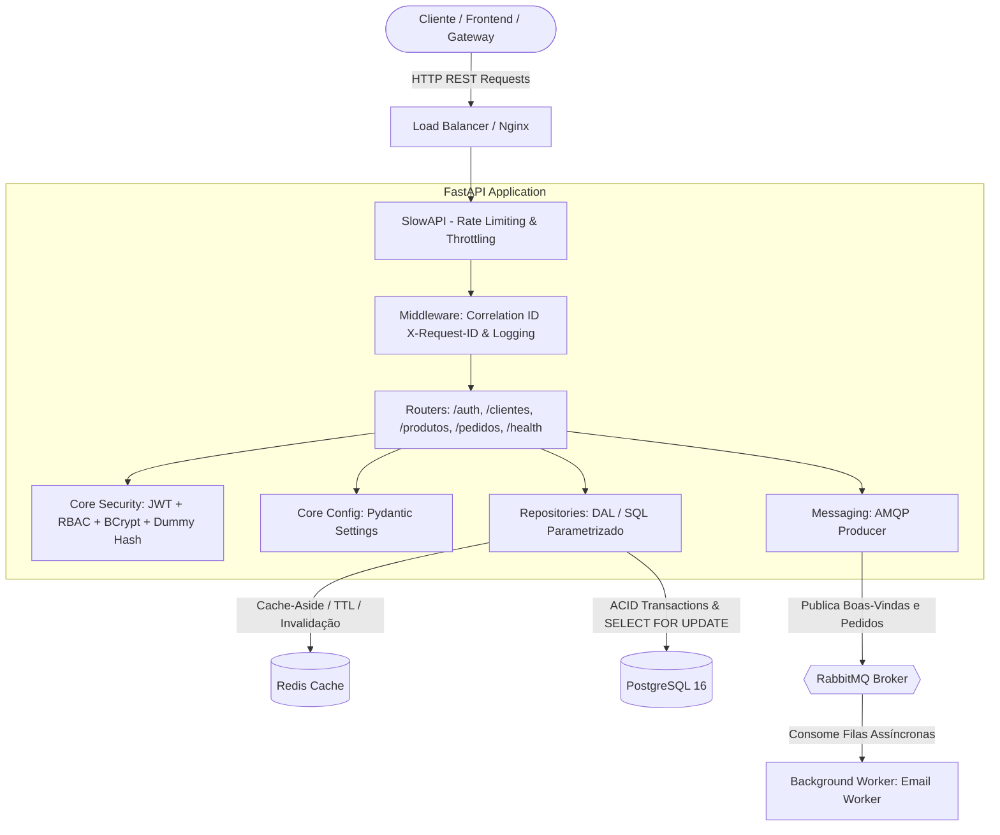

<div align="center">

# 👗 Loja de Roupas — Enterprise REST API & Asynchronous Architecture

**Uma API RESTful corporativa de alto desempenho para gestão de e-commerce, catálogo de moda e vendas, construída com arquitetura limpa, mensageria assíncrona, cache distribuído, controle de concorrência ACID, observabilidade estruturada e orquestração multi-container.**

[](https://www.python.org/)
[](https://fastapi.tiangolo.com/)
[](https://www.postgresql.org/)
[](https://redis.io/)
[](https://www.rabbitmq.com/)
[](https://www.docker.com/)
[](https://docs.pytest.org/)
[](https://github.com/)

</div>

---

## 🏛️ Visão Geral da Arquitetura

O sistema adota os princípios de **Clean Architecture**, **Separação de Responsabilidades (SRP)** e **12-Factor App**, dividindo a aplicação em camadas desacopladas de apresentação (Routers), regras de segurança e configuração (Core), repositórios de acesso a dados (Repositories), publicação de eventos (Messaging) e processos autônomos de segundo plano (Workers).



---

## 💡 Decisões de Engenharia & Destaques Técnicos

* ⚡ **Cache-Aside com Invalidação Ativa (Redis)**: Leitura acelerada de catálogo de produtos e clientes via cache em memória com tempo de vida (*TTL*). Mutações (`POST`, `PATCH` ou `DELETE`) e checkouts de pedidos invalidam instantaneamente as chaves correspondentes no Redis, eliminando dados desatualizados (*stale cache*).
* 🔒 **Transações ACID com Trava Pessimista (`SELECT FOR UPDATE`)**: No checkout de pedidos (`/pedidos`), o PostgreSQL bloqueia a linha da peça no estoque a nível de registro durante a transação, impedindo que dois clientes comprem o último item simultaneamente (*race conditions* / *overselling*).
* 📬 **Mensageria Assíncrona & Workers (RabbitMQ + Pika)**: O envio de e-mails de boas-vindas e comprovantes de compra ocorre de forma totalmente desacoplada. A API responde ao cliente em milissegundos e enfileira o evento para processamento em background pelo worker.
* 🛡️ **Segurança Ofensiva & Blindagem de Autenticação**:
  * **Mitigação de Timing Attack**: Uso de *dummy hash* fixo na memória para manter o tempo de resposta constante (~250ms) no login, impossibilitando a enumeração de nomes de usuários válidos por cronometria.
  * **Refresh Token Rotation**: Cada ciclo de renovação em `/auth/refresh` revoga o token anterior e emite um par novo de tokens, prevenindo ataques de repetição (*Token Replay Attacks*).
  * **RBAC (*Role-Based Access Control*)**: Controle de acesso granular onde administradores gerenciam catálogo e cadastros, enquanto funcionários realizam vendas e consultas.
* 📊 **Observabilidade & Health Check Ativo**:
  * **Correlation ID (`X-Request-ID`)**: Rastreabilidade ponta a ponta em cada requisição HTTP e nos registros do log estruturado.
  * **Endpoint `/health`**: Sondagem ativa de prontidão e vivacidade (*liveness/readiness probes*) testando conectividade real com PostgreSQL, Redis e RabbitMQ.
* 🧪 **CI/CD com Service Containers Reais (GitHub Actions)**: Pipeline que inicializa containers reais de banco, cache e mensageria, executa as migrations SQL sequenciais e roda a suíte de 27 testes automatizados.

---

## 🛠️ Tecnologias Utilizadas

| Camada | Tecnologia | Finalidade |
|---|---|---|
| **Framework Web** | FastAPI + Uvicorn | API assíncrona de alta performance com documentação OpenAPI/Swagger |
| **Banco de Dados** | PostgreSQL 16 + Psycopg2 | Persistência relacional com transações ACID, constraints e índices |
| **Camada de Cache** | Redis 7 (Alpine) | Armazenamento chave-valor em memória para otimização de leitura |
| **Message Broker** | RabbitMQ 3 (Management) | Fila de mensageria assíncrona e desacoplamento de workers |
| **Validação de Dados** | Pydantic v2 + Pydantic-Settings | Schemas tipados e centralização de variáveis de ambiente |
| **Segurança & Auth** | Python-Jose + Passlib (BCrypt) | Emissão/validação de JWT com rotação e hash irreversível de senhas |
| **Rate Limiting** | SlowAPI | Controle de tráfego e mitigação de ataques de força bruta |
| **Observabilidade** | Standard Logging + ContextVars | Logs estruturados com Correlation ID e endpoint `/health` |
| **Conteinerização** | Docker + Docker Compose | Orquestração completa dos serviços em ambiente isolado |
| **Testes & CI** | Pytest + HTTPX + GitHub Actions | Pipeline automatizado com service containers reais |

---

## 🚀 Como Executar o Projeto

Graças à orquestração multi-container, o ecossistema inteiro sobe com **um único comando**:

### Pré-requisitos
* [Docker](https://docs.docker.com/get-docker/) e [Docker Compose](https://docs.docker.com/compose/) instalados.

### Passo a Passo

1. **Clone o repositório:**
   ```bash
   git clone https://github.com/RafaelSantanaM/loja_roupas.git
   cd loja_roupas
   ```

2. **Configure as variáveis de ambiente:**
   ```bash
   cp .env.example .env
   ```

3. **Inicie todos os serviços com Docker Compose:**
   ```bash
   docker compose up --build
   ```

---

## 🌐 Endpoints & Documentação Interativa

Após iniciar os containers, acesse a documentação interativa:

* 📖 **Swagger UI (OpenAPI)**: [http://localhost:8000/docs](http://localhost:8000/docs)
* 📑 **Redoc**: [http://localhost:8000/redoc](http://localhost:8000/redoc)
* 🐰 **Painel de Gestão RabbitMQ**: [http://localhost:15672](http://localhost:15672) *(login: `guest` / senha: `guest`)*

### Matriz de Endpoints da API

| Domínio | Método | Endpoint | Descrição | Acesso / RBAC | Rate Limit |
|---|---|---|---|---|---|
| **Observabilidade** | `GET` | `/health` | Checagem ativa de saúde (Postgres, Redis, RabbitMQ) | Público | — |
| **Observabilidade** | `GET` | `/` | Confirmação de status e instância ativa | Público | — |
| **Autenticação** | `POST` | `/auth/login` | Login com proteção anti-timing attack (Dummy Hash) | Público | 5 req/min |
| **Autenticação** | `POST` | `/auth/refresh` | Rotação de Refresh Token e emissão de novo Access Token | Público | 10 req/min |
| **Autenticação** | `POST` | `/auth/logout` | Revogação ativa de sessão no banco | Autenticado | — |
| **Clientes** | `GET` | `/clientes` | Listagem paginada e filtrável de clientes | Autenticado | 60 req/min |
| **Clientes** | `GET` | `/clientes/{id}` | Busca de cliente com cache Redis | Autenticado | — |
| **Clientes** | `POST` | `/clientes` | Cadastro de cliente e publicação na fila AMQP | Autenticado | — |
| **Clientes** | `PATCH` | `/clientes/{id}` | Atualização parcial e invalidação de cache | Autenticado | — |
| **Clientes** | `DELETE` | `/clientes/{id}` | Remoção de cliente e invalidação de cache | **Apenas Admin** | — |
| **Produtos** | `GET` | `/produtos` | Listagem paginada do catálogo de roupas | Autenticado | 60 req/min |
| **Produtos** | `GET` | `/produtos/{id}` | Detalhes da peça com cache Redis | Autenticado | — |
| **Produtos** | `POST` | `/produtos` | Cadastro de nova peça no catálogo | **Apenas Admin** | — |
| **Produtos** | `PATCH` | `/produtos/{id}` | Atualização de preço/estoque e invalidação de cache | **Apenas Admin** | — |
| **Produtos** | `DELETE` | `/produtos/{id}` | Remoção de peça (com integridade referencial) | **Apenas Admin** | — |
| **Pedidos** | `POST` | `/pedidos` | Checkout com trava pessimista (SELECT FOR UPDATE) | Autenticado | 20 req/min |
| **Pedidos** | `GET` | `/pedidos` | Histórico paginado de compras | Autenticado | 60 req/min |
| **Pedidos** | `GET` | `/pedidos/{id}` | Detalhes de um pedido específico | Autenticado | — |

---

## 🧪 Executando os Testes Automatizados

Para rodar a suíte completa de testes unitários e de integração:

```bash
# Ative o ambiente virtual e execute o pytest
pytest -v
```

---

## 📂 Estrutura do Projeto

```
loja_roupas/
├── .github/workflows/ci.yml       # Pipeline CI com Service Containers (Postgres, Redis, RabbitMQ)
├── app/
│   ├── core/                      # Módulos transversais
│   │   ├── config.py              # Pydantic Settings (12-Factor App)
│   │   ├── security.py            # Hashing BCrypt, JWT e mitigação de timing attack
│   │   ├── cache.py               # Camada de Cache-Aside com Redis
│   │   └── logger.py              # Logging Estruturado com Correlation ID ContextVar
│   ├── db/
│   │   ├── session.py             # Conexão segura com PostgreSQL
│   │   └── migrations/            # Migrações SQL numeradas (001 a 004)
│   ├── messaging/                 # Publicador de eventos assíncronos AMQP
│   │   └── email_producer.py
│   ├── repositories/              # Camada de Acesso a Dados (DAL - Repository Pattern)
│   │   ├── cliente_repo.py
│   │   ├── produto_repo.py
│   │   ├── pedido_repo.py
│   │   ├── usuario_repo.py
│   │   └── refresh_token_repo.py
│   ├── routers/                   # Endpoints HTTP da API (FastAPI APIRouter)
│   │   ├── auth_router.py
│   │   ├── clientes_router.py
│   │   ├── produtos_router.py
│   │   ├── pedidos_router.py
│   │   └── health_router.py
│   ├── schemas/                   # Schemas Pydantic de validação e serialização
│   │   ├── auth_schemas.py
│   │   ├── cliente_schemas.py
│   │   ├── produto_schemas.py
│   │   └── pedido_schemas.py
│   ├── workers/                   # Background Workers assíncronos
│   │   └── email_worker.py
│   ├── dependencies.py            # Injeção de dependências (OAuth2 & RBAC)
│   ├── limiter.py                 # Rate Limiter configurado (SlowAPI)
│   └── main.py                    # Middleware de rastreabilidade e montagem do FastAPI
├── docs/                          # Guias conceituais e base de conhecimento
│   ├── 01-modelagem-e-transacoes.md
│   ├── 02-autenticacao-jwt.md
│   ├── 03-rbac-autorizacao.md
│   ├── 04-testes-automatizados.md
│   ├── 05-roadmap-backend.md
│   └── README.md
├── tests/                         # Suíte de 27 testes automatizados
│   ├── conftest.py                # Fixtures globais do Pytest
│   ├── test_auth_unit.py          # Testes unitários de segurança
│   └── test_api_integration.py    # Testes de integração de endpoints
├── docker-compose.yml             # Orquestração completa de 5 serviços
├── Dockerfile                     # Imagem Docker otimizada
├── requirements.txt               # Dependências do projeto
└── README.md                      # Documentação técnica principal
```

---

<div align="center">
Desenvolvido por <b>Rafael Santana</b> — Conecte-se comigo no <a href="https://github.com/RafaelSantanaM">GitHub</a>!
</div>
