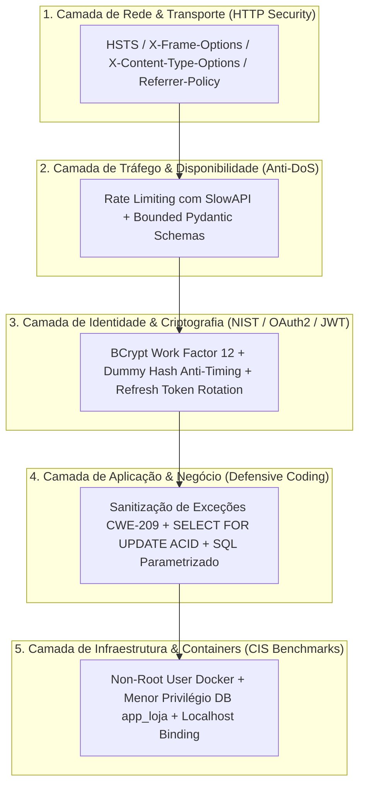

# 🛡️ Guia de Cibersegurança, Hardening e Boas Práticas (OWASP, NIST & CIS)

Este documento consolida os padrões, protocolos e diretrizes de **segurança ofensiva e defensiva** implementados na arquitetura da **Loja de Roupas API**. Ele serve como registro de estudo e referência técnica de padrões corporativos internacionais (como **OWASP API Security Top 10**, **NIST SP 800-63B**, **CIS Docker Benchmarks** e **RFCs da IETF**).

---

## 🏛️ 1. Princípio da Defesa em Profundidade (*Defense in Depth*)

No mercado corporativo de alta maturidade, a segurança da informação nunca depende de uma única barreira. Adotamos o modelo de **Defesa em Profundidade**, estruturado em 5 camadas independentes:



---

## 🌐 2. Protocolos de Transporte e Cabeçalhos HTTP de Segurança

Injetados automaticamente em todas as respostas HTTP via middleware em `app/main.py`:

| Cabeçalho HTTP | RFC / Padrão | Finalidade Técnica | Ataque Prevenido |
|---|---|---|---|
| **`Strict-Transport-Security`** | RFC 6797 | Força os clientes a utilizarem exclusivamente HTTPS (`max-age=31536000; includeSubDomains`). | **SSL-Stripping / Man-in-the-Middle (MitM)** |
| **`X-Content-Type-Options`** | RFC 7231 | Desabilita a adivinhação do tipo MIME pelo navegador (`nosniff`). | **MIME-Sniffing / Execução de Arquivos Maliciosos (Polyglots)** |
| **`X-Frame-Options`** | RFC 7034 | Impede a renderização das respostas e documentações em `<iframe>` ou `<object>` (`DENY`). | **Clickjacking (UI Redressing Attacks)** |
| **`Referrer-Policy`** | W3C Standard | Controla o envio de caminhos e parâmetros no header `Referer` (`strict-origin-when-cross-origin`). | **Vazamento de Dados Sensíveis por URL** |
| **`X-XSS-Protection`** | Legado / Defesa em Profundidade | Ativa o filtro do navegador contra injeção de scripts refletidos (`1; mode=block`). | **Reflected Cross-Site Scripting (XSS)** |

---

## 🔐 3. Autenticação, Criptografia e Resistência a Ataques de Canal Lateral

Implementado em `app/core/security.py` e `app/routers/auth_router.py`:

### A. Mitigação de Timing Attack (*CWE-208 / NIST SP 800-63B*)
* **Mecanismo**: Quando um usuário tenta fazer login com um `username` inexistente no banco, a API executa uma verificação criptográfica fictícia contra a constante `DUMMY_BCRYPT_HASH`.
* **Vetor de Ataque Mitigado**: **Enumeração de Usuários por Temporização (*User Enumeration*)**. O cálculo do BCrypt consome ~250ms de CPU. Se o usuário inexistente respondesse em 1ms, invasores utilizariam ferramentas automatizadas (como *ffuf* ou *Hydra*) para descobrir quais e-mails estão cadastrados no banco de dados medindo o tempo de resposta da API.

### B. Rotação de Refresh Token (*Refresh Token Rotation — RFC 6749 / RFC 6819*)
* **Mecanismo**: A cada requisição em `POST /auth/refresh`, o token antigo é **imediatamente revogado no banco de dados (`revogado = TRUE`)**, e um novo par (Access Token + Refresh Token) com um novo identificador único (`jti` - *JWT ID*) é gerado.
* **Vetor de Ataque Mitigado**: **Ataques de Repetição (*Token Replay Attacks*) & Roubo de Sessão**. Se um refresh token de 7 dias for interceptado, ele se torna inútil logo após o primeiro uso legítimo.

### C. Bloqueio de Algoritmo JWT (*Algorithm Confusion — RFC 7519*)
* **Mecanismo**: A verificação de tokens JWT trava o parser explicitamente para `algorithms=["HS256"]`.
* **Vetor de Ataque Mitigado**: **Ataque de `alg: none` e Assinatura por Chave Pública (CVE-2015-9235)**, impedindo que tokens adulterados sem assinatura sejam aceitos pelo servidor.

---

## 🚦 4. Proteção contra DoS e Esgotamento de Recursos (*OWASP API4*)

### A. Rate Limiting Granular (SlowAPI)
Controle de vazão por endereço IP em endpoints sensíveis:
* `POST /auth/login` (5 req/min): Mitiga ataques de força bruta contra senhas.
* `POST /auth/refresh` (10 req/min) e `POST /auth/logout` (15 req/min): Evita flood de sessões.
* `GET /health` (30 req/min): Protege os pools de conexão do PostgreSQL e sockets do RabbitMQ contra esgotamento (*Connection Pool Starvation*).
* Mutações de Clientes e Produtos (30 req/min): Evita inserção automatizada em massa (*Database Flooding*).

### B. Schemas Estritos e Limitados (*Input Bounding*)
Em `app/schemas/cliente_schemas.py`, campos textuais possuem validações estritas de comprimento:
```python
nome: str = Field(..., min_length=2, max_length=100)
telefone: Optional[str] = Field(None, max_length=20)
endereco: Optional[str] = Field(None, max_length=255)
```
* **Vetor de Ataque Mitigado**: **Denial of Service por Payload Gigante (Memory Exhaustion / Buffer Overflow)**. Payloads com strings de centenas de megabytes são barrados na camada HTTP (`422 Unprocessable Entity`) antes de alocarem memória excessiva no Python ou sobrecarregarem o PostgreSQL.

---

## 🛡️ 5. Sanitização de Erros & Prevenção de Vazamento de Informações (*CWE-209*)

* **O Princípio**: O cliente externo **nunca** deve ter acesso a stack traces, detalhes do driver de banco de dados (`psycopg2.errors...`), nomes de tabelas ou constraints internas.
* **Implementação**:
  1. A API captura as exceções internas.
  2. O erro técnico e o stack trace detalhado são salvos exclusivamente no log interno do servidor via `logger.error(..., exc_info=True)`.
  3. O cliente HTTP recebe uma resposta amigável e segura (ex: `{"detail": "E-mail já cadastrado"}` ou `{"detail": "Dados inválidos"}`).
* **Vetor de Ataque Mitigado**: **Reconhecimento de Infraestrutura (*Database Fingerprinting*)**.

---

## 🐳 6. Segurança de Containers & Menor Privilégio (*CIS Docker Benchmarks*)

Implementado no `Dockerfile` e `docker-compose.yml`:

### A. Execução sem Root no Container (*Non-Root User*)
* **Diretiva**: `USER appuser` no `Dockerfile`.
* **Benefício**: Se houver uma vulnerabilidade de execução remota de código (RCE) em qualquer biblioteca de terceiros, o invasor estará confinado em um processo sem privilégios administrativos, impossibilitando a quebra de isolamento do container (*Container Breakout*).

### B. Princípio do Menor Privilégio no Banco de Dados (*Principle of Least Privilege — PoLP*)
* **Configuração**: A aplicação executa suas operações como usuário `app_loja` (DML: `SELECT`, `INSERT`, `UPDATE`, `DELETE`), e não como o superusuário `postgres`.
* **Benefício**: Mesmo em caso de comprometimento da aplicação, o invasor não possui permissões administrativas (DDL/DCL) para criar bancos, alterar tabelas do sistema (`pg_catalog`) ou desligar o banco.

### C. Isolamento de Portas de Infraestrutura (*Localhost Binding*)
* **Configuração**: Portas do banco e filas vinculadas como `127.0.0.1:5434:5432` no `docker-compose.yml`.
* **Benefício**: Impede a exposição acidental de portas internas para a internet aberta (proteção contra varreduras de ferramentas como *Shodan* e *Censys*).

---

## 🧪 7. Testes Automatizados de Segurança (Pytest)

Em `tests/test_api_integration.py`, a suíte conta com testes automatizados específicos para validar a integridade das medidas de segurança:
1. `test_headers_de_seguranca_owasp_presentes_na_resposta`: Valida que todas as respostas HTTP carregam os 5 cabeçalhos OWASP.
2. `test_schema_cliente_rejeita_payload_com_nome_ou_endereco_gigante`: Valida a rejeição imediata de payloads que excedem os limites estabelecidos.
3. `test_fluxo_refresh_token_com_rotacao`: Valida o ciclo completo de uso único e rotação de tokens.
4. `test_logout_revoga_refresh_token`: Valida a revogação ativa no banco.
5. `test_funcionario_nao_pode_criar_produto`: Valida as políticas de autorização RBAC.
